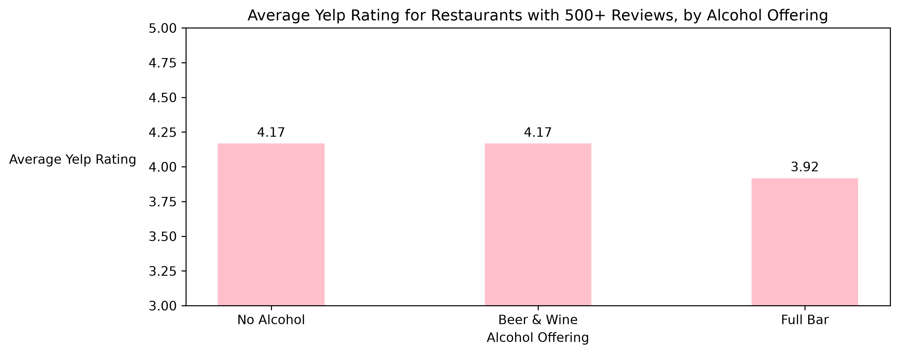
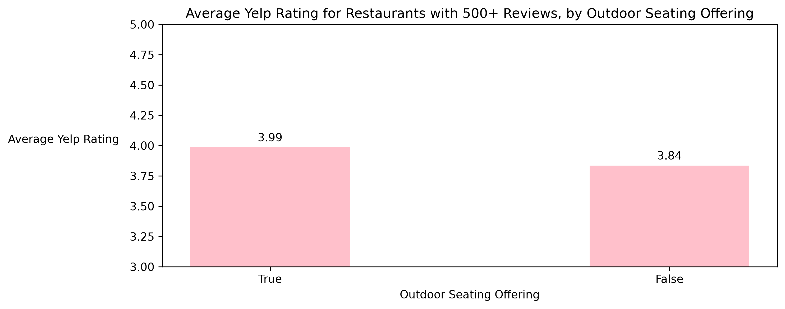

# IDS-706-Assignment-2-Data-Analysis

## Overview

This project explores data analysis, data engineering, and machine learning concepts using the Yelp Open Dataset.

https://business.yelp.com/data/resources/open-dataset/

This assignment includes 1. an analysis between restaurant attributes and Yelp star ratings, 2. a performance between Pandas and Polars, and 3. experimentation with Rust's ownership system.

**_Note: The Yelp Open Dataset is not included in this repository due to its file size. Download the yelp_academic_dataset_business.json file here: https://business.yelp.com/data/resources/open-dataset/_**

## Analysis between restaurant attributes and Yelp star ratings

### Project Question/Goal

What restaurant characteristiscs are associated with higher Yelp star ratings?

I analyzed restaurant attributes such as outdoor seating, delivery, alcohol offerings, bike parking and other characteristics to explore their relationships with a restaurant's Yelp star rating.

I trained a Random Forest regression model to deterimine specifically which attributes were most useful in predicting restaurant ratings.

### Data

The analysis uses business data from Yelp Open Dataset. The data contains many types of business, including beauty salons and dentists, so I filtered the data to:

- Businesses categorized as 'Restaurant'
- Restaurants with at least 500 reviews

This led me to have 1,263 restaurants to work with.

### Data Cleaning

The 'attributes' column contains restaurant characteristics stored in a dictionary-like structure.

To clean and prepare the data, I:

1. Expanded attributes into individual columns
2. Cleaned inconsistent string representations
3. Calculated the percentage of each attribute to see which ones had the highest amount of data
4. Removed attributes that did not have a high percentage
5. Focused on simple attributes rather than nested dictionary attributes
6. Converted 'RestaurantsPriceRange2' to a numeric variable

Missing values were kept where appropriate because the absence of a characteristic in Yelp's data doesn't necessarily mean that the restaurant doesn't have that characteristic.

### Machine Learning

I used a Random Forest regression model to predict Yelp star ratings using restaurant attributes.

Target variable: 'stars'
Predictors: cleaned list of restaurant attributes

Categorical attributes were converted into numeric features using one-hot encoding. 'RestaurantsPriceRange2' was converted to numeric values and passed through without one-hot encoding.

The dataset was split into 80% training data and 20% testing data.

The Random Forest model used 200 decision trees.

The model received a Mean Absolute Error (MAE) of 0.322 stars, meaning that the model's predicted rating differed from the actual Yelp rating by 0.32 stars on average.

To identify the restaurant characteristics most useful for predicting Yelp ratings, I used Random Forest feature importance.

One-hot encoding creates multiple model features from a single restaurant attribute, so I grouped the importance scores of the encoded featuures back into their original attribute.

The highest-ranked attributes:

1. Alcohol
2. Outdoor Seating
3. Happy Hour
4. Restaurant Delivery
5. TV Availability
6. Bike Parking
7. Dogs Allowed
8. Smoking
9. Wheelchair Accessibility
10. Restaurant Table Service

### Interpretation

For attributes that Random Forest considered important, the differences in average ratings were generally small.

Feature importance represents how useful a variable is for prediction, but does not indicate whether an attribute would cause a rating to increase or decrease. Differences in average ratings represent associations rather than causal relationships.

## Performance between Pandas and Polars

I compared performance between Pandas and Polars by 1. filtering data and 2. grouping data and calculating summary statistics. The differences in each were small, but performance depends on many factors such as dataset size and system environments.

Pandas filtering time: 0.020480 seconds  
Polars filtering time: 0.019030 seconds

Pandas grouping and summary statistics time: 0.016093 seconds  
Polars grouping and summary statistics time: 0.016181 seconds

## Experimentation with Rust's ownership system

I modified a Rust Jupyter notebook to demonstrate Rust's ownership system. I created a vector of colors. I assigned the vector to another variable to transfer ownership. After this, the original vector can no longer be used.

## Reproducing Analysis

1. Clone repository

2. Create a virtual environment
   `python3 -m venv .venv`

3. Activate the environment
   ` source .venv/bin/activate`

4. Install dependencies
   `pip install -r requirements.txt`

5. Download the Yelp Open Dataset and place it in the provided data directory

**_The Yelp Open Dataset is not included in this repository due to its file size._**

https://business.yelp.com/data/resources/open-dataset/

Download the Yelp Open Dataset, unpack the .tar file, and place the yelp_academic_dataset_business.json inside the data folder.

6. Run the analysis
    
   Run yelp_data.py
