# IDS-706-Assignment-2-Data-Analysis

## Overview

[](https://github.com/tientle/IDS-706-Assignment-2-Data-Analysis/actions/workflows/test.yml)

Refactoring slogan: Refactor because the code deserves a glow-up :)

This project explores data analysis, data engineering, and machine learning concepts using the Yelp Open Dataset.

The original analysis explored three areas:

1. The relationship between restaurant attributes and Yelp star ratings using a Random Forest regression model
2. A performance comparison between Pandas and Polars
3. Experimentation with Rust's ownership system

The project has been expanded to make the analysis more reproducible and reliable. The Python analysis workflow was refactored into reusable functions for data filtering, cleaning, preprocessing, and machine learning. Unit and integration tests were added using `pytest`, code quality is checked using Black and flake8, and a GitHub Actions continuous integration (CI) workflow automatically validates the project across multiple Python versions. The project is also containerized with Docker to provide a reproducible environment for running the test suite.

**_Note: The Yelp Open Dataset is not included in this repository due to its file size. Download the yelp_academic_dataset_business.json file here: https://business.yelp.com/data/resources/open-dataset/_**

## Analysis between restaurant attributes and Yelp star ratings

### Project Question/Goal

**What restaurant characteristics are associated with higher Yelp star ratings?**

Yelp ratings can have real-world implications for both restaurants and customers. Customers often use ratings to decide where to eat, while restaurant owners can use customer feedback and data to better understand how their business is perceived.

I wanted to explore whether characteristics that restaurants can control or offer, such as outdoor seating, delivery, alcohol offerings, bike parking, and other amenities, are associated with differences in Yelp star ratings.

I trained a Random Forest regression model to explore which restaurant attributes/characteristics were most useful for predicting ratings. These characteristics don't necessarily cause higher ratings, but help to identify patterns that could provide insight into the characteristics associated with customer ratings.

### Data

The analysis uses business data from Yelp Open Dataset. The data contains many types of business, including beauty salons and dentists, so I filtered the data to:

- Businesses with `"Restaurants"` in their Yelp categories
- Businesses with at least 500 reviews

This led me to have 1,263 restaurants to work with.

### Data Cleaning

The 'attributes' column contains restaurant characteristics stored in a dictionary-like structure.

To clean and prepare the data, I:

1. Expanded attributes into individual columns
2. Cleaned inconsistent string representations
3. Calculated the coverage of each attribute to understand how much data was available for each characteristic
4. Examined attributes with at least 75% coverage
5. Focused the analysis on simple attributes rather than nested dictionary attributes
6. Converted 'RestaurantsPriceRange2' to a numeric variable

Missing values were kept where appropriate because the absence of a characteristic in Yelp's data doesn't necessarily mean that the restaurant doesn't have that characteristic.

As part of making the analysis more reproducible, the filtering and cleaning steps were refactored into reusable functions. These functions are also tested independently in the project's test suite.

### Machine Learning

I used a Random Forest regression model to predict Yelp star ratings using restaurant attributes.

Target variable: 'stars'
Predictors: cleaned list of restaurant attributes

Categorical attributes were converted into numeric features using one-hot encoding. 'RestaurantsPriceRange2' was converted to numeric values and passed through without one-hot encoding.

The dataset was split into 80% training data and 20% testing data.

The Random Forest model used 200 decision trees.

The model received a Mean Absolute Error (MAE) of 0.322 stars, meaning that the model's predicted rating differed from the actual Yelp rating by 0.32 stars on average.

To identify the restaurant characteristics most useful for predicting Yelp ratings, I used Random Forest feature importance.

One-hot encoding creates multiple model features from a single restaurant attribute, so I grouped the importance scores of the encoded features back into their original attribute and summed their feature importance scores.

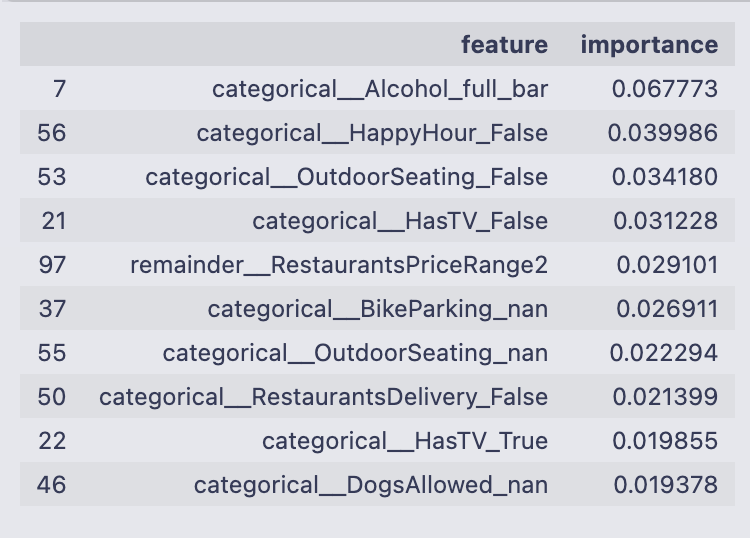

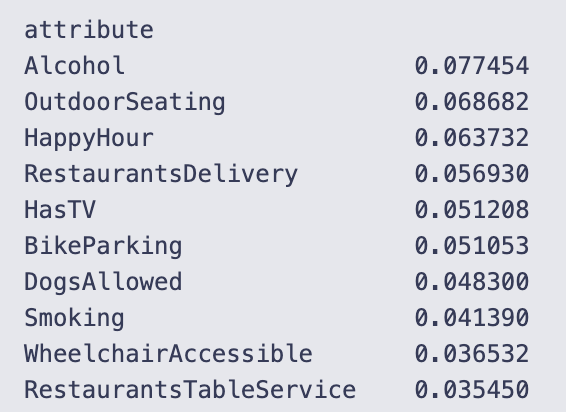

The highest-ranked attributes:

1. Alcohol
2. Outdoor Seating
3. Happy Hour
4. Restaurant Delivery
5. TV Availability
6. Bike Parking
7. Dogs Allowed
8. Smoking
9. Wheelchair Accessibility
10. Restaurant Table Service

Using the top 10 combined feature importance scores, I calculated the mean star rating and restaurant count for each attribute.

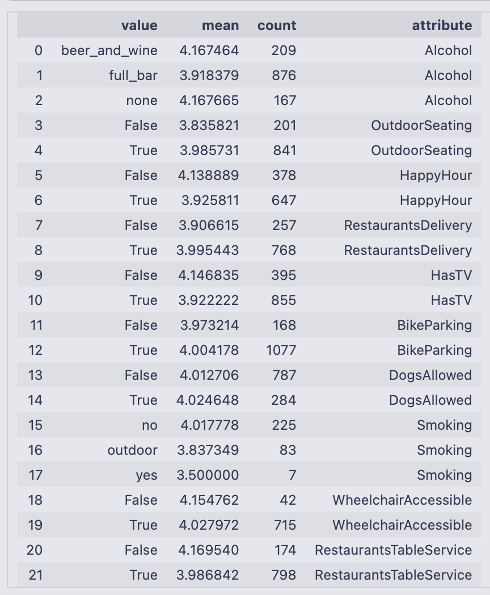

### Interpretation

For attributes that Random Forest considered important, the differences in average ratings were generally small.

Feature importance represents how useful a variable is for prediction, but does not indicate whether an attribute would cause a rating to increase or decrease. Differences in average ratings represent associations rather than causal relationships.

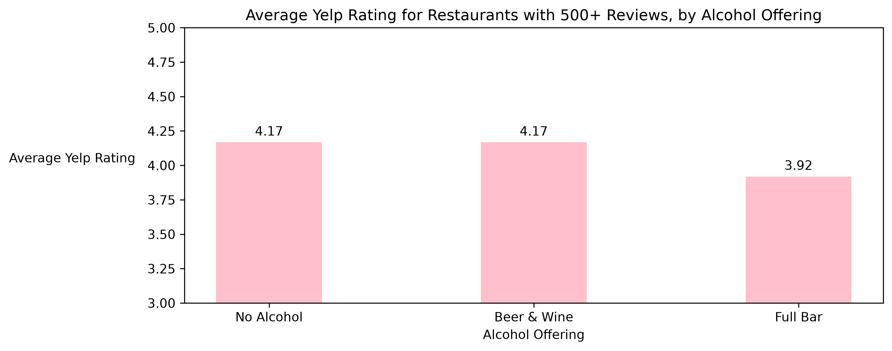

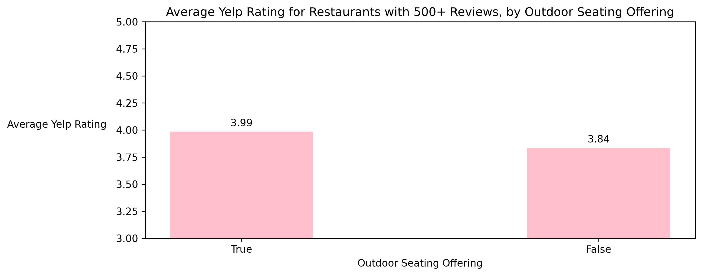

## Performance between Pandas and Polars

I compared performance between Pandas and Polars by 1. filtering data and 2. grouping data and calculating summary statistics. The differences in each were small, but performance depends on many factors such as dataset size and system environments.

Pandas filtering time: 0.020480 seconds <br>
Polars filtering time: 0.019030 seconds

Pandas grouping and summary statistics time: 0.016093 seconds <br>
Polars grouping and summary statistics time: 0.016181 seconds

## Experimentation with Rust's ownership system

I modified a Rust Jupyter notebook to demonstrate Rust's ownership system. I created a vector of colors. I assigned the vector to another variable to transfer ownership. After this, the original vector can no longer be used.

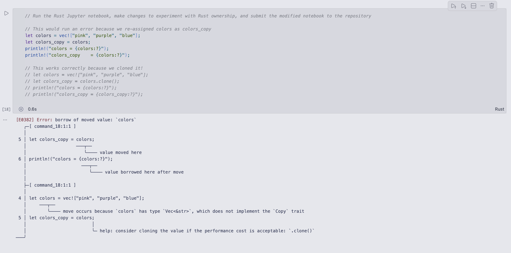

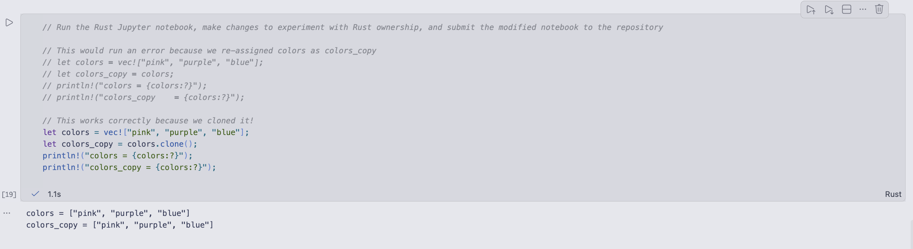

## Reproducing the Analysis

To reproduce this analysis locally:

1. Clone this repository and navigate into the project directory.

2. Create a virtual environment:

   ```bash
   python3 -m venv .venv
   ```

3. Activate the virtual environment:

   ```bash
   source .venv/bin/activate
   ```

4. Install the required dependencies:

   ```bash
   pip install -r requirements.txt
   ```

5. Download the [Yelp Open Dataset](https://business.yelp.com/data/resources/open-dataset/).

   **The Yelp Open Dataset is not included in this repository due to its file size.**

   Download and unpack the dataset, then place `yelp_academic_dataset_business.json` inside the project's `data/` directory:

   ```text
   data/
   └── yelp_academic_dataset_business.json
   ```

6. Run the analysis:

   ```bash
   python yelp_data.py
   ```

   The script runs the full analysis workflow, including filtering the Yelp data to restaurants with at least 500 reviews, cleaning and preprocessing restaurant attributes, training the Random Forest regression model, evaluating its predictions, calculating feature importance, and generating the project visualizations.

### Reproducing the Test Environment with Docker

Docker can be used to reproduce the environment required to run the automated test suite without creating a local Python virtual environment:

```bash
docker build -t yelp-analysis .
docker run --rm yelp-analysis
```

## Testing

To improve the reliability of the original analysis, I refactored key parts of the workflow into reusable functions and created a test suite using `pytest`.

Run all tests from the root of the repository with:

```bash
python -m pytest testing/test_yelp_data.py -v
```

The current test suite contains seven tests covering:

- Restaurant filtering
- String and business attribute cleaning
- Removal of nested attributes
- Feature preprocessing and encoding
- Feature importance calculations
- The end-to-end workflow from data processing through model training, prediction, and evaluation

All seven tests currently pass successfully:

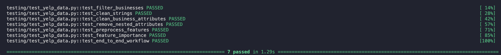

## Continuous Integration

GitHub Actions automatically validates the project whenever changes are pushed to the repository or submitted through a pull request. The workflow can also be run manually from the **Actions** tab and is scheduled to run weekly.

The CI workflow includes:

- Testing across Python 3.12 and 3.13 using a matrix strategy
- Code formatting validation with Black
- Code quality checks with flake8
- The full seven-test `pytest` suite
- Building the Docker image
- Running the test suite inside the Docker container

### Python Version Matrix

The workflow uses a matrix strategy to run the test suite independently with Python 3.12 and Python 3.13.

Testing multiple Python versions helps identify compatibility issues that may not appear in a single development environment.

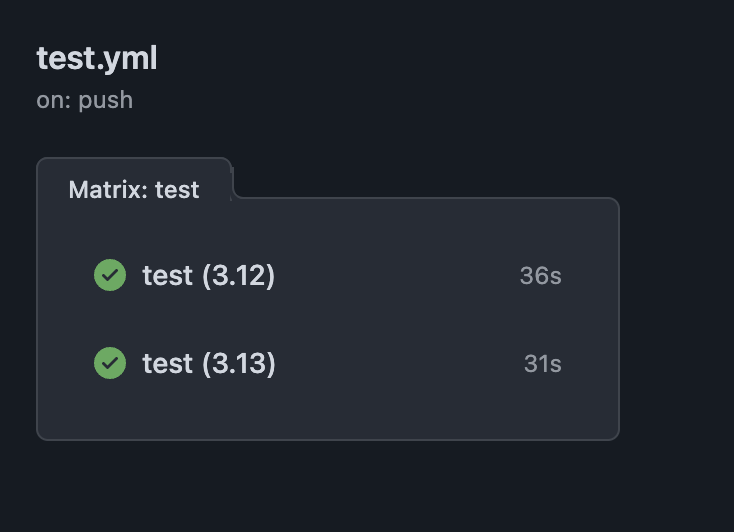

### Successful CI Workflow

The workflow successfully runs the full validation pipeline across Python 3.12 and 3.13, including formatting, linting, automated tests, and Docker validation.

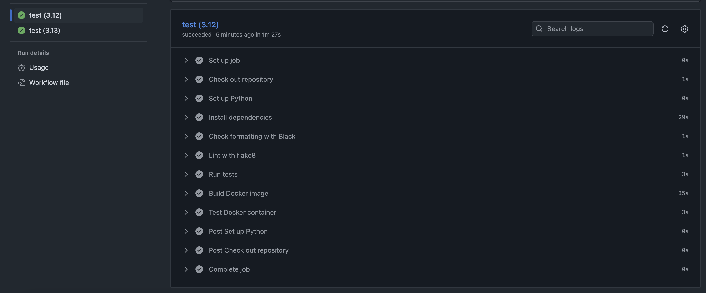

## Code Quality and Refactoring

The original analysis was refactored to separate key data-processing and machine-learning operations into reusable functions. This made individual parts of the workflow easier to test and reduced the amount of analysis logic contained directly in the main script.

Refactored functionality includes:

- Filtering businesses by category and review count
- Cleaning Yelp attribute strings and missing values
- Removing nested attributes
- Preprocessing categorical and numeric features
- Mapping encoded features back to their original restaurant attributes
- Aggregating feature importance scores

Black is used to maintain consistent Python formatting, while flake8 checks the source code and tests for style and code-quality issues. Both checks are also included in the GitHub Actions workflow.

### Refactoring Example

The following commit diff shows the preprocessing logic being refactored into a reusable `preprocess_features()` function. Previously, feature preprocessing was performed directly in the main analysis workflow. The refactored version separates this logic into its own function and replaces the original preprocessing code with a function call, making it easier to test and reuse.

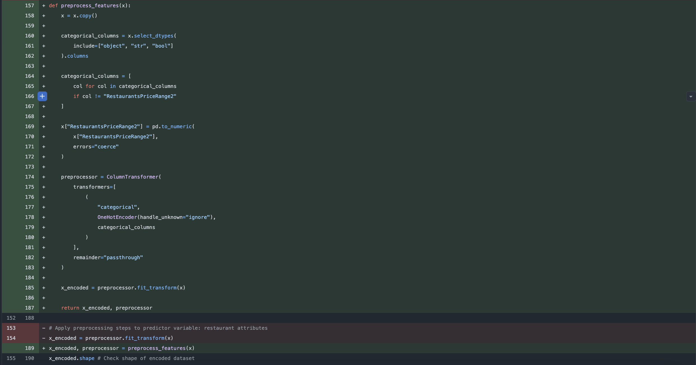

## Docker

The project is containerized with Docker to provide a reproducible Python environment for running the test suite. Through this process, I learned how Docker packages the project's dependencies and test commands into a reproducible environment so the same test suite can run consistently outside my local Python environment.

Build the Docker image from the root of the repository:

```bash
docker build -t yelp-analysis .
```

Run the container:

```bash
docker run --rm yelp-analysis
```

The container automatically runs the project's `pytest` suite. A successful run should complete all seven tests.

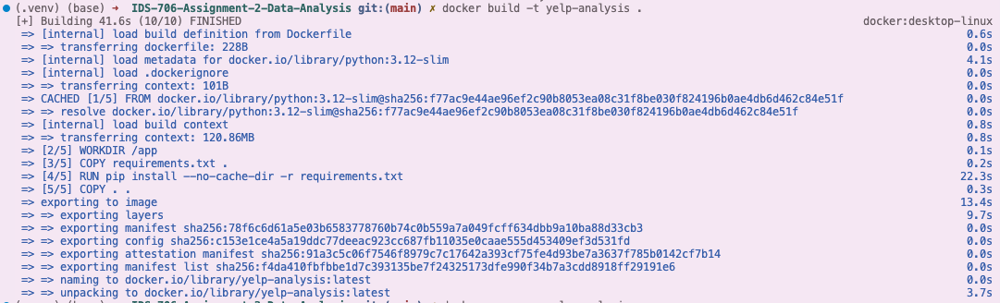

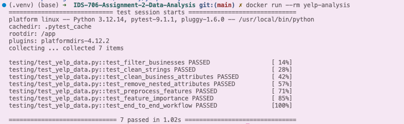
